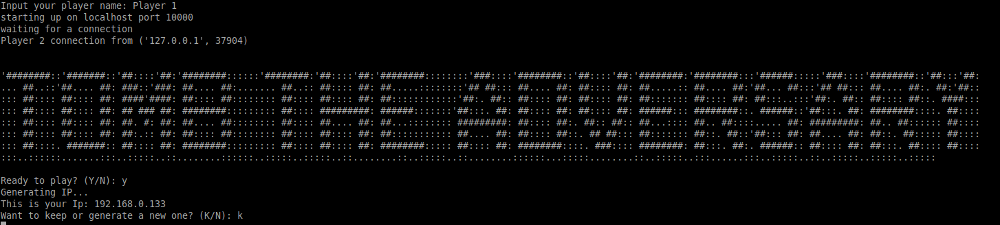
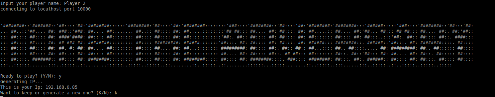
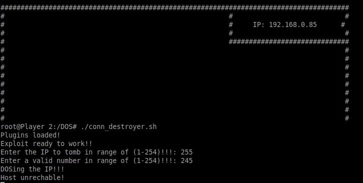
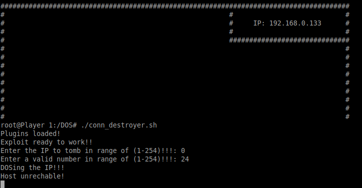
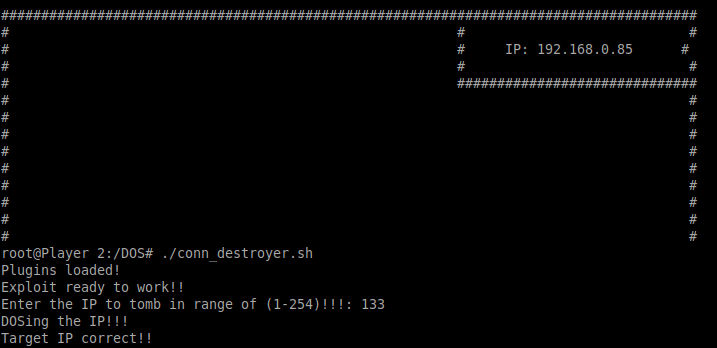
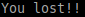

# Tomb-The-Adversary

Tomb The Adversary (TTA) is a 1vs1 game similar to Battleship, but with the difference that instead of trying to find the ships, we try to find the IP of the adversary, to knock it down.

---

## How To Play!

#### Init

First we have to initialize the server script, enter our player name and the second player starts the client script and enters his name.

Once the connection is made, a banner will appear, with the title of the game, and a random "IP" will be generated.

#### Play interface

When starting the guessing, we will be asked to enter a number from 1 to 254, and we will take turns to see who guesses the opponent's "IP" first.

At the moment in which one of the players guesses the rival "IP", he will win, the connection will be closed, and the losing player will see a message that will say: **"You Lost!!"**

